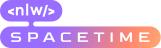
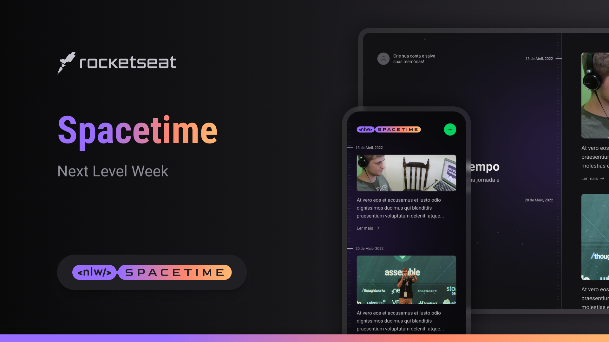
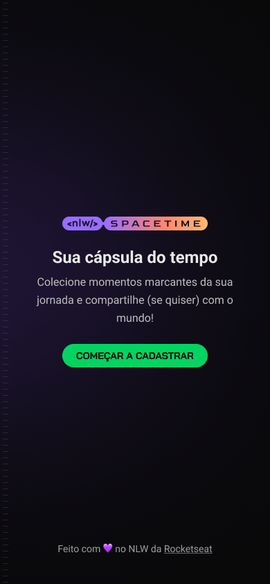
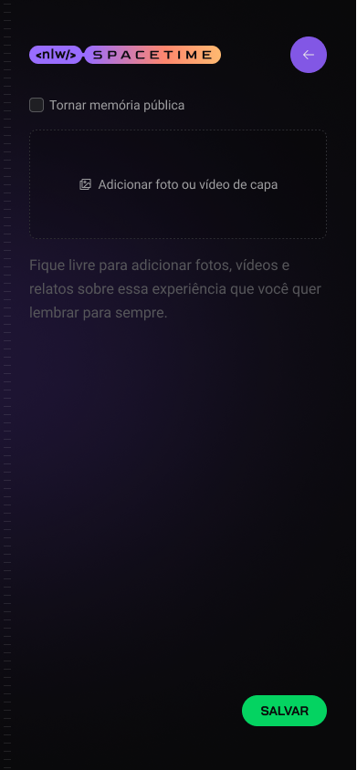
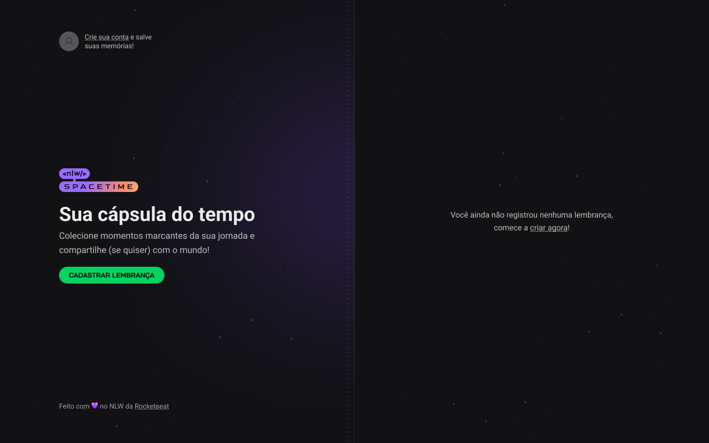
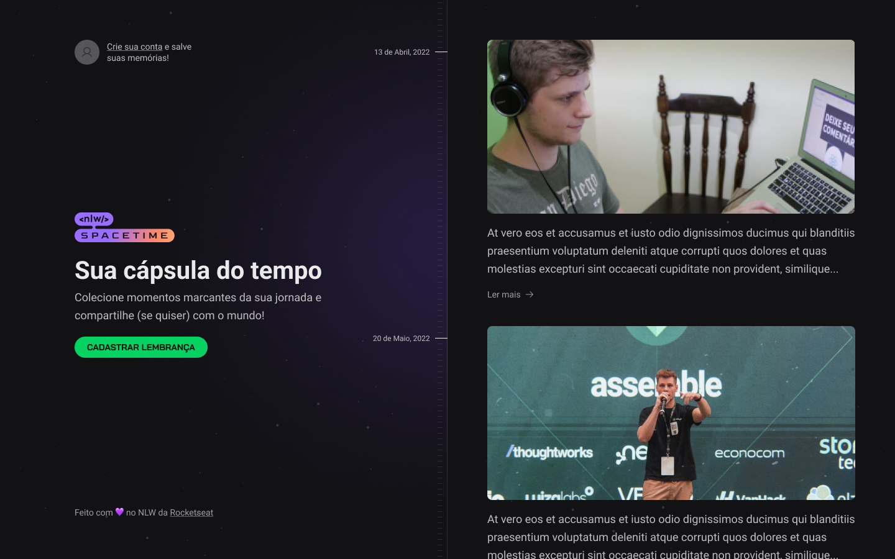
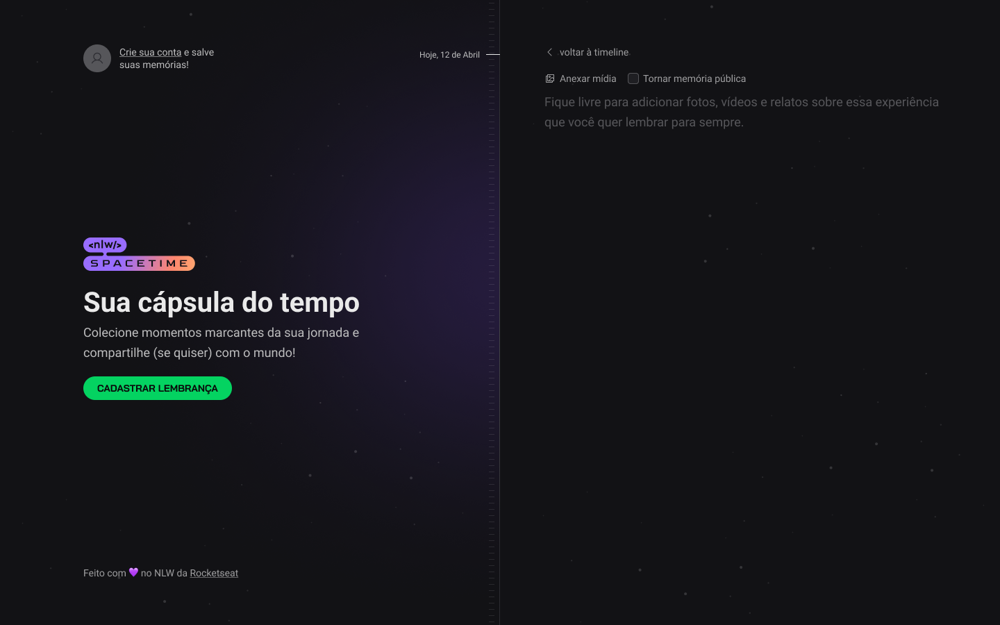
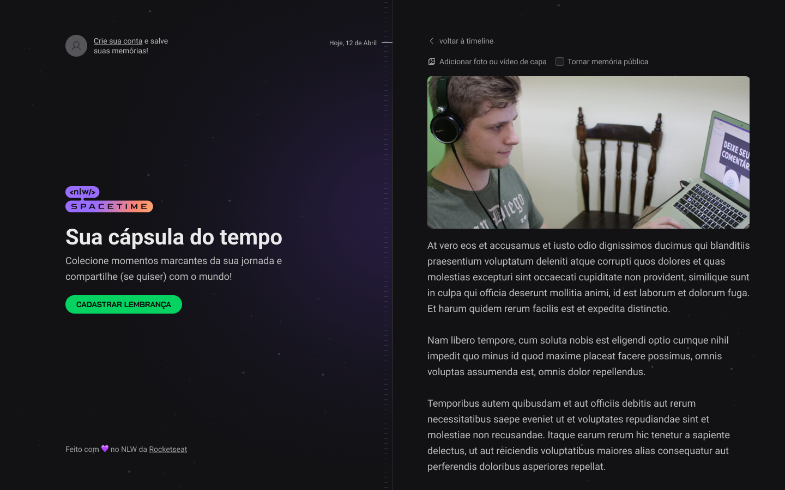

<h1 align="center" id="project_name">
  <br />
  
  <br />
</h1>

<p align="center">
Spacetime
</p>

<p align="center">
  <!-- GitHub last commit -->
  <a href="https://github.com/erik-albuquerque/spacetime/commits/main">
    
  </a>
  <!-- GitHub language count -->
  
  <!-- GitHub top language -->
  
  <!-- Repository size -->
  
  <!-- Repository status -->
  
  <!-- Link repo -->
  <a href="https://github.com/erik-albuquerque/habits/blob/main/LICENSE.md">
    
  </a>
</p>

<p align="center">
 <a href="#about">Sobre</a> •
 <a href="#layout">Layout</a> • 
 <a href="#technologies">Tecnologias</a> • 
 <a href="#author">Autor</a> • 
 <a href="#license">Licença</a>
</p>

<p align="center">
  
</p>

<h4 align="center">
  	🚧 Spacetime | Concluído 🚧
</h4>

<h2 id="about">
💻 Sobre
</h2>

Aplicação de recordação de memórias, onde o usuário poderá adicionar à uma timeline textos, fotos e vídeos de acontecimentos marcantes da sua vida, organizados por mês e ano.

Projeto desenvolvido durante o evento NLW Spacetime da [Rocketseat](https://www.rocketseat.com.br/).

<h2 id="layout">🎨 Layout</h2>

<a href="https://www.figma.com/community/file/1240070456276424762">
  
</a>

### Mobile

<p align="center" style="display: flex; align-items: flex-start; flex-direction: row; flex-wrap: wrap; gap: 16px;">
  

  

  

  
</p>

### Web

<p align="center" style="display: flex; align-items: flex-start; flex-direction: row; flex-wrap: wrap; gap: 16px;">
  

  

  

  
</p>

<br />
<h2 id="technologies">🛠 Tecnologias</h2>

As seguintes ferramentas foram usadas na construção do projeto:

#### Mobile
- **[React Native](https://reactnative.dev/)**
- **[TypeScript](https://www.typescriptlang.org/)**
- **[Expo](https://expo.dev/)**
- **[NativeWind](https://www.nativewind.dev/)**
- **[Expo SecureStore](https://docs.expo.dev/versions/latest/sdk/securestore/)**
- **[Expo AuthSession](https://docs.expo.dev/versions/latest/sdk/auth-session/)**
- **[Expo ImagePicker](https://docs.expo.dev/versions/latest/sdk/imagepicker/)**
- **[Expo Font](https://docs.expo.dev/versions/latest/sdk/font/)**
- **[dayjs](https://github.com/iamkun/dayjs)**
- **[Axios](https://axios-http.com/docs/intro)**
> Veja o arquivo [package.json](package.json)

#### Web

- **[React](https://reactjs.org/)**
- **[Next.js 13](https://nextjs.org/)**
- **[TypeScript](https://www.typescriptlang.org/)**
- **[TailwindCSS](https://tailwindcss.com/)**
- **[js-cookie](https://github.com/js-cookie/js-cookie)**
- **[jwt-decode](https://github.com/auth0/jwt-decode)**
- **[clsx](https://github.com/lukeed/clsx)**
- **[tailwind-merge](https://github.com/dcastil/tailwind-merge)**
- **[dayjs](https://github.com/iamkun/dayjs)**
- **[Axios](https://axios-http.com/docs/intro)**
> Veja o arquivo [package.json](package.json) 

#### API

- **[Prisma](https://www.prisma.io/)**
- **[Fastify](https://www.fastify.io/)**
- **[Axios](https://axios-http.com/docs/intro)**
- **[Zod](https://github.com/colinhacks/zod)**
- **[dayjs](https://github.com/iamkun/dayjs)**
- **[fastify-plugin](https://github.com/fastify/fastify-plugin)**
- **[@fastify/cors](https://github.com/fastify/fastify-cors)**
- **[@fastify/jwt](https://github.com/fastify/fastify-jwt)**
- **[@fastify/multipart](https://github.com/fastify/fastify-multipart)**


> Veja o arquivo [package.json](package.json)

**Utilidades**

- IDE: **[Visual Studio Code](https://code.visualstudio.com/)**
- Icones: **[Lucide Icons](https://lucide.dev/)**
- Fontes: **[Roboto](https://fonts.google.com/specimen/Roboto)** e **[Bai Jamjuree](https://fonts.google.com/specimen/Bai+Jamjuree)**


<h2 id="prerequisites">💿 Como executar o projeto</h2>

### 🧰 Pré-requisitos

Antes de começar, você vai precisar ter instalado em sua máquina as seguintes ferramentas:

> [Git](https://git-scm.com), [Node.js](https://nodejs.org/en/) e [NPM](https://www.npmjs.com/) ou [Yarn](https://yarnpkg.com/) se for sua preferência.
> Além disto é bom ter um editor para trabalhar com o código como [VSCode](https://code.visualstudio.com/)

### 🧭 Rodando o projeto

```bash
# Clone este repositório
$ git clone https://github.com/erik-albuquerque/spacetime.git

# 1° - rodando o servidor (API)

# Acesse a diretório do servidor em `spacetime/server`
$ cd spacetime/server
# Instale as dependências (npm ou yarn)
$ npm install
# Rode as `migrations` do banco de dados
$ npx prisma migrate dev
# Execute a aplicação em modo de desenvolvimento
$ npm run dev
# agora o endpoint vai ser http://localhost:3333

# 2° - O app web

# Acesse a diretório do servidor em `spacetime/web`
$ cd spacetime/web
# Instale as dependências (npm ou yarn)
$ npm install
# Execute a aplicação em modo de desenvolvimento
$ npm run dev
# agora o endpoint vai ser http://localhost:3000

# 3° - O app Android/IOS

# Acesse a diretório do servidor em `spacetime/mobile`
$ cd spacetime/mobile
# Instale as dependências (npm ou yarn)
$ npm install
# Execute a aplicação em modo de desenvolvimento
$ npm run start
# Se você for rodar o app no celular Android/IOS
# instale o app Expo GO na sua loja de aplicativos.
# Caso seja emulador, para configurar o ambiente de 
# desenvolvimento, consulte https://react-native.rocketseat.dev/


```

<h2 id="contributors">📫 Como contribuir para o projeto</h2>

1.  Faça um **fork** do projeto.
2.  Crie um branch: `git checkout -b <nome_branch>`.
3.  Faça suas alterações e confirme-as: `git commit -m '<mensagem_commit>'`.
4.  Envie para a branch original: `git push origin <nome_branch>`.
5.  Crie a solicitação pull.

> Como alternativa, consulte a documentação do GitHub em [como criar uma solicitação pull](https://help.github.com/en/github/collaborating-with-issues-and-pull-requests/creating-a-pull-request)

## 👨‍💻 Contribuidores

Agradecemos às seguintes pessoas que contribuíram para este projeto:

<table>
  <tr>
    <td align="center">
      <a href="#">
        <!----><br>
        <sub>
          <b></b>
        </sub>
      </a>
    </td>
  </tr>
</table>

<h2 id="author">🦸 Autor</h2>
<a href="https://github.com/erik-albuquerque">
 
 <br />
 <sub><b>Érik Albuquerque</b></sub></a>

[](https://www.linkedin.com/in/erik-albuquerque/)
[](mailto:erik.albuquerque.oficial@gmail.com)

<h2 id="license">📝 Licença</h2>

Distribuído sob a licença MIT. Veja a [LICENSE](LICENSE) para mais informações.

Feito com ❤️ por Érik Albuquerque 👋🏽 [Entre em contato!](https://www.linkedin.com/in/erik-albuquerque/)

[⬆ Voltar ao topo](#project_name)<br />